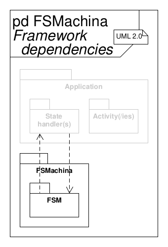

<!--
Keywords:
embedded, embedded-systems, finite-state-machine, framework, fsm,
state-machine, synchronous
-->

# FSMachina - Simple finite state maschine framework

This framework employs a simple and tiny

*synchronous, non-hierarchical, finite state maschine*

to manage software system states.

## Requirements specification

The following loosely lists requirements, constraints, features and goals.

* Synchronous, non-hierarchical, finite state maschine for real-time
  applications in embedded systems
* Partly UML-compliant
* Implementation of states by reentrant state handler functions
* Supports entry, exit and also internal and external transition activities
* Supports extended state variables
* States, events and extended state variables are user-coded and predefined at
  compile time
* UML transition actions are supported but only in a different order:
  transition action (implemented within the source state),
  exit action (of source state), entry action (of target state)
* Hierarchical state maschine topologies can be implemented by flattenig the
  state space (this topology transformation is always possible)

<!-- Separator -->

* Framework design
* Deployment in embedded systems
* Code implementation in the C programming language ("C99", ISO/IEC 9899:1999)
* Interfaces with the application software through state handler functions,
  event enumerations and extended state variables

<!-- Separator -->

* Low impact on technical budgets
    * Low CPU utilization
    * Small memory footprint in ROM (text, data) and RAM (data, heap, stack)
    * Runs (also) well on "small" MCUs (e.g., AVR ATmega328P/Arduino Uno)
* Quality model
    * "Simple" (low complexity of software architecture and detailed design,
      essential features only)
    * Modular
    * Re-usable
    * Portable
    * Unit tested with 100 % coverage (LOC executed, branches taken, functions
      called)
    * Defined quality metrics (see table below)
    * MISRA-C:2012 compliant
    * Static code analysis pass
    * No dynamic memory allocation (via `malloc()` or similar)
    * SCM via Git with [Semantic Versioning](https://semver.org)
* Well documented (from requirements over architecture to detailed design),
  using Doxygen, Markdown, custom diagrams, UML
* Traceability from requirements specification to implementation by
  transitivity

Quality metrics:

| Metric                                       | Target   |
| -------------------------------------------- | -------- |
| No. of parameters/arguments (per func.)      | \<= 6    |
| No. of instructions (per func.)              | \<= 60   |
| No. of nested control structures (per func.) | \<= 5    |
| Cyclomatic complexity number (per func.)     | \<= 10   |
| Comment rate (per file)                      | \>= 20 % |
| Unit test (decision) coverage                | = 100 %  |

## Extended state variables

There are two options to add extended state variables to a state machine
application software implementation:

**Option A - Private attributes**

This option simply uses private attributes (i.e. static globals with file
scope) in the application’s module that implements the state handler functions
(or a separate module alltogether).
If necessary, operations (access functions) can allow setting or retieving the
values of these extended state variables.

**Option B - Class derivation**

This option is based on the method of deriving a new class from the
framework-provided base class by creating a new struct with the framework’s
`stc_fsm_t` struct as its first member.
Extended state variables can now be implemented as additional struct members.

However, this implies that all access of the extended state variables from
within the state handler functions (through the `me` pointer input argument)
must be downcasted.
These explicit downcasts are safe as long as the `me` input argument always
points to a derived class instance.
In other words, state handler functions associated with this derived state
maschine class must only be used with `me` pointers of the derived struct type
and never directly with the framework’s `stc_fsm_t` struct (base class), as the
state handler function’s signature might otherwise suggest.

Furthermore, when using the framework’s API operations (outside of the
associated state handler functions), it is necessary to explicitly upcast the
`me` input argument pointer to the framework-provided `stc_fsm_t` struct (base
class).

## Run-to-completion steps and critical regions

If there are hardware interrupts enabled in the system that can interfere with
the run-to-completion steps of the framework’s FSM, the transitions can be
placed within critical regions in the user code.
That is, disabling interrupts directly before the `fn_fsm_tran()` function call
and enabling them again directly after in the state handler functions.

## Extension for asynchronous behaviour

The state machine can be made asynchronous by adding a (FIFO) event queue and
posting events to that queue (instead of directly to the state machine).
This event queue is then processed in a periodic task (of the scheduling
entity), which "feeds" the next event in the queue to the state machine.
It must be ensured that this event queue never fills up entirely, in order to
prevent losing events.
To achieve this, the event queue size and periodic task frequency must be
chosen properly.

## Architecture

## Coding Standard

### Applicable Guidelines

This project aims to adhere to the following guidelines (with exceptions):

* The Power of Ten - Rules for Developing Safety Critical Code (NASA/JPL; G. J.
  Holzmann)
* MISRA C:2012 - Guidelines for the use of the C language in critical systems

If necessary, deviations from the guidelines are allowed but must be justified
and documented by means of inline comments.

### Further Style Conventions

Furthermore, the style is only loosely defined:

New added code should use the same style (i.e. "look similar") as the already
existing code base.

Some remarks on the non-obvious points of this style convention:

* Files are divided into an "attributes" and "operations" section (just like
  classes in a UML class diagram)
* `#include`s are placed in a module’s implementation (`*.c`) file(s), except
  when they include header files external to the project (e.g. libc) or if a
  module already uses another project-internal API in its own API (in both
  exceptional cases those `#include`s are then placed in the module’s header
  file)
* Multiple instructions (ending with `;`) within a macro are enclosed in a
  `do {...} while (false)` loop
* The limit for line breaks is 80 characters (slight overshoots are acceptable
  if it increases readability and if used sparingly)
* Whitespace is inserted after control flow structure keywords (e.g.
  `if/for/while/switch/return (...)`)
* Comments
    * ... can be placed above one or multiple line(s) (code block), addressing
      all following line(s) until the next empty line or lesser indentation
      level
    * ... can be placed at the end of a line, addressing this line only
    * ... can be placed below a long line with one additional indentation level
      to address this one long line in a code block where a comment does not
      fit at the end of the line
* Far away closing brackets/keywords of control structures are commented to
  indicate to what they belong (e.g. `#endif /* MODULENAME_H */`)
* API functions/macros/variables ("globals") etc. are prefixed with their
  module’s (abbreviated) name + `_`;  
  if the project is intended to be included in another project (e.g. the
  project is a library or framework), the prefix also starts with up to 3
  characters that abbreviate the project name
* Private, file-scope (`static`) variables are prefixed with `pv_`
* Pointers are prefixed with `p_`
* Types are suffixed with `_t`
* In object-oriented code, the pointer argument to an object of a class’
  function is named `me`

## Workflow

This project uses a simple topic branch Git workflow.
The only permanently existing branches are "develop" (development status;
unstable) and "master" (release status; stable).
New development efforts are done in separate topic branches, which are then
merged into develop once ready.
For releases, the "develop" branch is then merged into "master".
Fast-forward merges are preferred, if possible.
