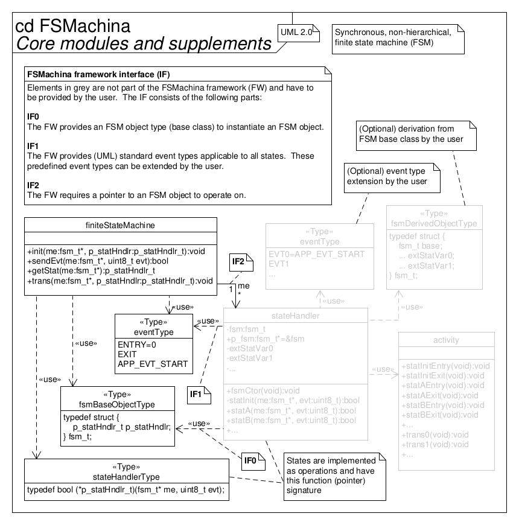

# fsMachina - Simple finite state maschine framework

This framework employs a simple and tiny

*synchronous, non-hierarchical, finite state maschine*

to manage software system states.

## Requirements specification

The following loosely lists requirements, constraints, features and goals.

* Synchronous, non-hierarchical, finite state maschine for real-time
  applications in embedded systems
* Partly UML-compliant
* Implementation of states by reentrant state handler functions
* Supports entry, exit and also internal and external transition activities
* Supports extended state variables
* States, events and extended state variables are user-coded and predefined at
  compile time
* UML transition actions are supported but only in a different order:
  transition action (implemented within the source state),
  exit action (of source state), entry action (of target state)
* Hierarchical state maschine topologies can be implemented by flattenig the
  state space (this topology transformation is always possible)

* Framework design
* Deployment in embedded systems
* Code implementation in the C programming language ("C99", ISO/IEC 9899:1999)
* Interfaces with the application software through state handler functions,
  event enumerations and extended state variables

* Low impact on technical budgets
    * Low CPU utilization
    * Small memory footprint in ROM (text, data) and RAM (data, heap, stack)
    * Runs (also) well on "small" MCUs (e.g., AVR ATmega328P/Arduino Uno)
* Quality model
    * "Simple" (low complexity of software architecture and detailed design,
      essential features only)
    * Modular
    * Re-usable
    * Portable
    * No unused ("dead") code: optional functionality in seperate translation
      units (so it can be excluded by the linker) or conditionally included via
      preprocessor defines
    * Unit tested with 100 % coverage (LOC executed, branches taken, functions
      called)
    * MISRA-C:2012 compliant
    * Static code analysis pass
    * No dynamic memory allocation (via `malloc()` or similar)
    * SCM via Git with semantic versioning
* Well documented (from requirements over architecture to detailed design),
  using Doxygen, Markdown, custom diagrams, UML
* Traceability from requirements specification to implementation by
  transitivity

## Extended state variables

There are two options to add extended state variables to a state machine
application software implementation:

**Option A - Private attributes**

This option simply uses private attributes (i.e. static globals with file
scope) in the application’s module that implements the state handler functions
(or a separate module alltogether).
If necessary, operations (access functions) can allow setting or retieving the
values of these extended state variables.

**Option B - Class derivation**

This option is based on the method of deriving a new class from the
framework-provided base class by creating a new struct with the framework’s
`stc_fsm_t` struct as its first member.
Extended state variables can now be implemented as additional struct members.

However, this implies that all access of the extended state variables from
within the state handler functions (through the `me` pointer input argument)
must be downcasted.
These explicit downcasts are safe as long as the `me` input argument always
points to a derived class instance.
In other words, state handler functions associated with this derived state
maschine class must only be used with `me` pointers of the derived struct type
and never directly with the framework’s `stc_fsm_t` struct (base class), as the
state handler function’s signature might otherwise suggest.

Furthermore, when using the framework’s API operations (outside of the
associated state handler functions), it is necessary to explicitly upcast the
`me` input argument pointer to the framework-provided `stc_fsm_t` struct (base
class).

## Run-to-completion steps and critical regions

If there are hardware interrupts enabled in the system that can interfere with
the run-to-completion steps of the framework’s FSM, the transitions can be
placed within critical regions in the user code.
That is, disabling interrupts directly before the `fn_fsm_tran()` function call
and enabling them again directly after in the state handler functions.

## Architecture

